# Theme reference

All **178** bundled themes, in the exact order the picker numbers them.
The number on each theme is its **config number** — apply any of them
non-interactively with either:

```bash
install.sh <N>                  # at install time, skip the interactive picker
rust-my-claude init <N>         # any time after install
```

…or apply by name with `rust-my-claude theme set <name>` (then it patches
`settings.json` for you with `init`/`setup`).

Previews are rendered with sample data (`rust-my-claude theme preview <name>`)
using a Hack Nerd Font. Generated by [`scripts/render-screenshots.sh`](../scripts/render-screenshots.sh).

> Tip: `rust-my-claude theme list` prints this same list in your terminal.

---

### 1. `powerline`

Classic powerline pills, gauges, red-shift (the original look)

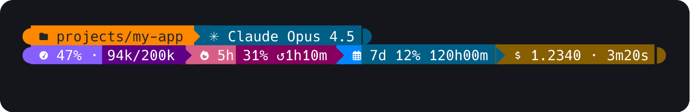

### 2. `minimal`

ASCII-safe, plain separators, model + context + cost only

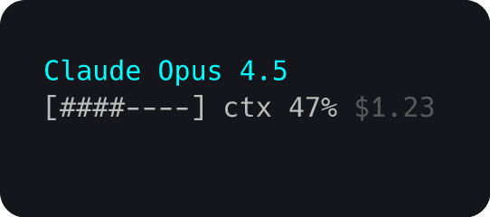

### 3. `nord`

Cool arctic palette, rounded pills

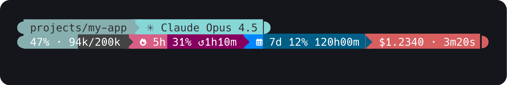

### 4. `agnoster`

Classic agnoster powerline — blue/cyan/green/red segments

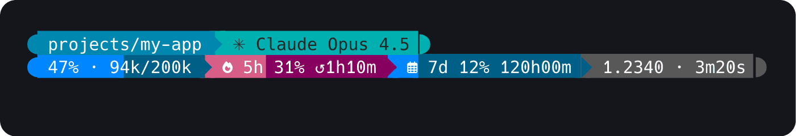

### 5. `dracula`

Dracula — purple, pink, cyan, green on dark slate

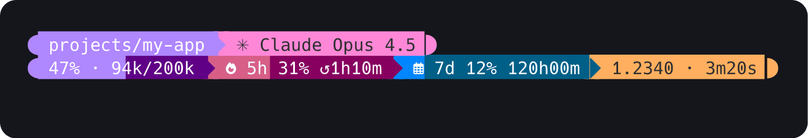

### 6. `gruvbox`

Gruvbox — warm retro orange/yellow/aqua on dark brown

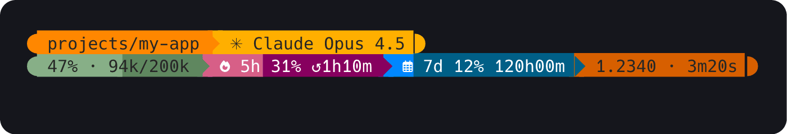

### 7. `tokyonight`

Tokyo Night — deep blue/purple/cyan night palette

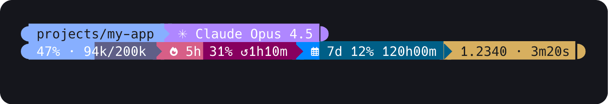

### 8. `catppuccin`

Catppuccin Mocha — soft pastel mauve/pink/teal/green

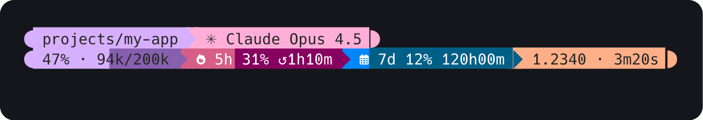

### 9. `solarized-dark`

Solarized Dark — base03 with yellow/blue/cyan accents

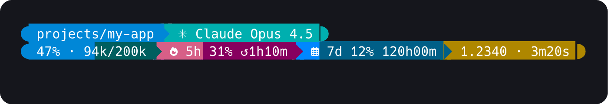

### 10. `solarized-light`

Solarized Light — light parchment bg, dark text

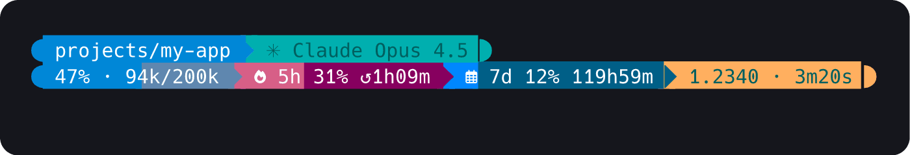

### 11. `monokai`

Monokai — vivid green/pink/orange/cyan on charcoal

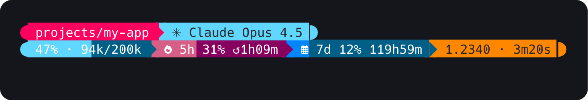

### 12. `onedark`

One Dark — Atom-style blue/green/red/purple

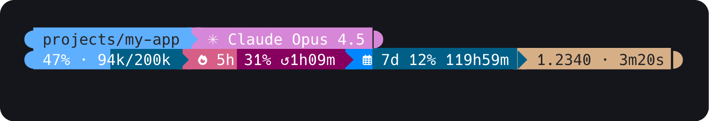

### 13. `rose-pine`

Rosé Pine — muted rose/gold/pine/foam

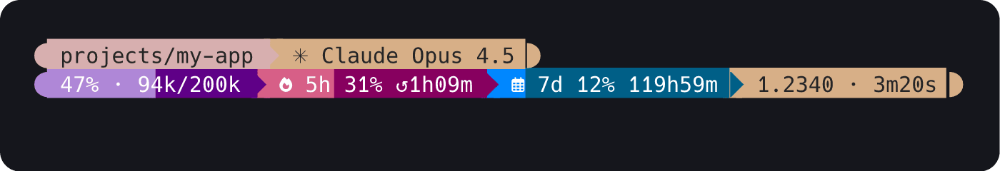

### 14. `cyberpunk`

Cyberpunk — neon magenta + cyan, maximum contrast

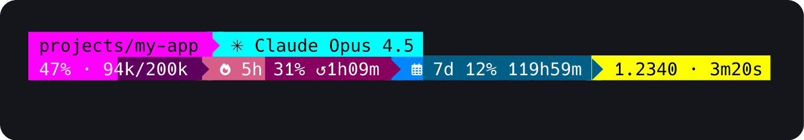

### 15. `matrix`

Matrix — monochrome green-on-black, plain separators

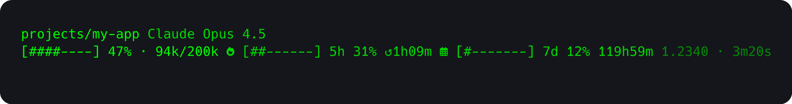

### 16. `bubbles`

Floating rounded bubbles (diamond style), colourful backgrounds

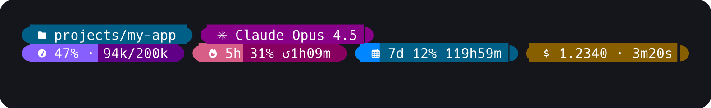

### 17. `chips`

Floating chips on a dark base, coloured labels (diamond style)

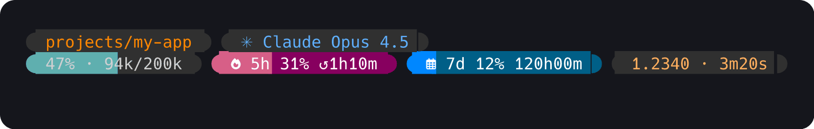

### 18. `cert`

Floating segments with slanted ice caps (diamond style)

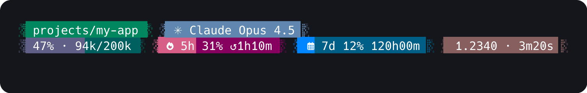

### 19. `flame`

Connected chain with flame-shaped dividers, ember palette

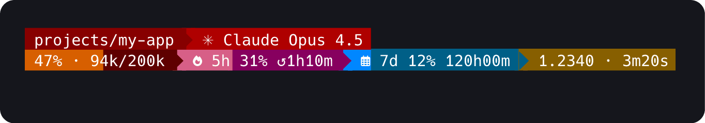

### 20. `slant`

Connected chain with angled/slanted dividers, cool palette

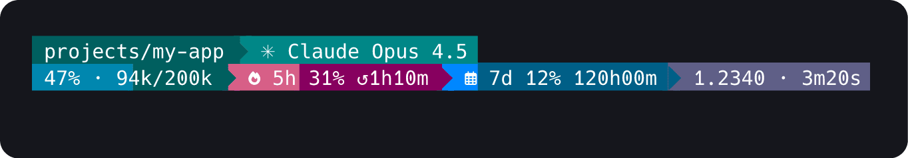

### 21. `emodipt`

Minimalist plain text, no backgrounds (transparent prompt)

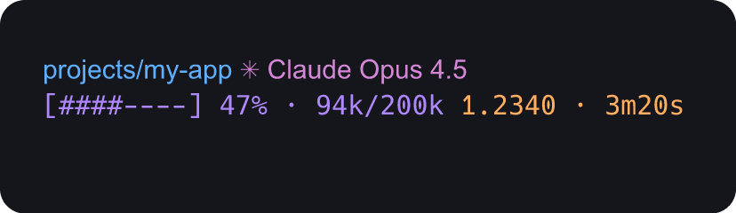

### 22. `jandedobbeleer`

Mixed diamond+powerline with round bubble caps (E0B6/E0B4) and standard chevron dividers; vivid palette of hot-pink directory, purple model, and yellow git on dark backgrounds.

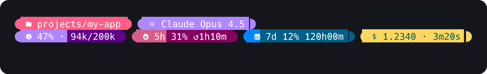

### 23. `powerlevel10k-rainbow`

Powerline chevron dividers with GNOME Tango palette: cobalt-blue directory, forest-green model, light-grey repo on near-white default background.

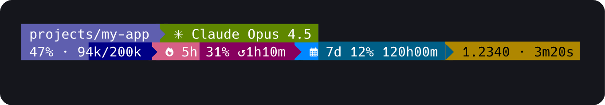

### 24. `powerlevel10k-lean`

Pure plain/transparent style with no backgrounds; cyan path, yellow git, and teal model on terminal background — ultra-minimal lean look.

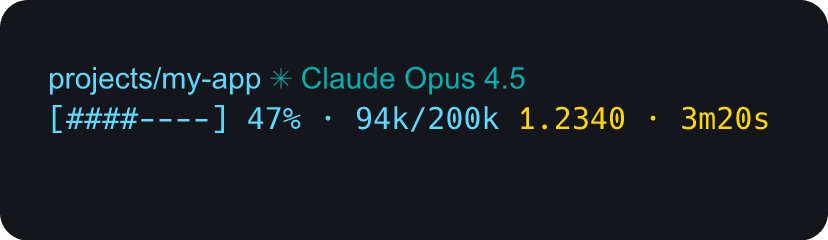

### 25. `powerlevel10k-modern`

Round diamond bubbles with rightward chevron dividers (E0B4); vivid blue directory, cyan-teal model, and lime-yellow cost on dark default background.

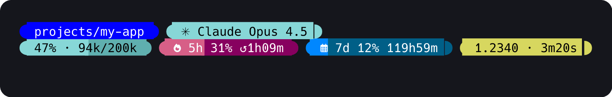

### 26. `paradox`

Powerline with pastel palette: sky-blue directory, warm-yellow model, mint-green git, violet repo — near-black text on classic right-arrow dividers.

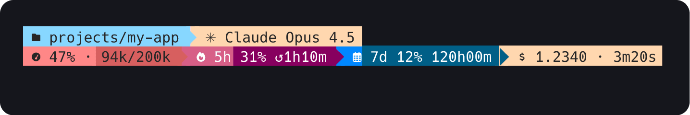

### 27. `agnosterplus`

Clean three-segment powerline: sky-blue path, white model, mint-green git — near-black text with blue accent on line 2, matching the agnosterplus original.

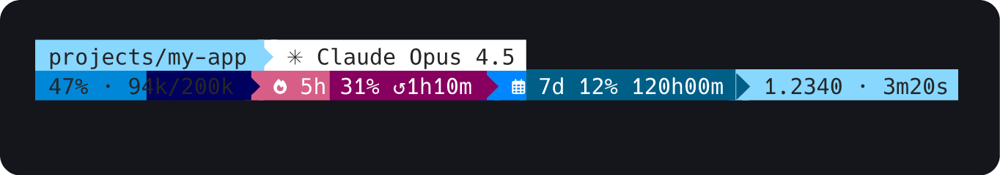

### 28. `agnoster-minimal`

Plain/transparent with VS Code blue (#007ACC → xterm 32) as the sole accent: no backgrounds, blue directory and context, steel-blue model and cost.

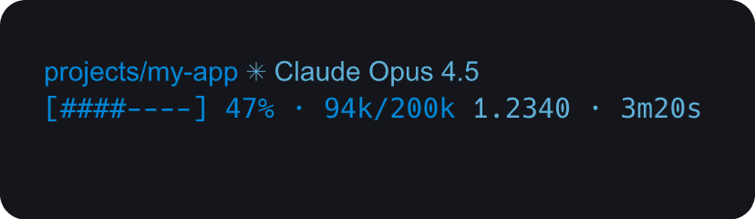

### 29. `robbyrussell`

Plain/transparent oh-my-zsh classic: teal directory, sage-green model, rosy-red git, yellow context gauge — no backgrounds, pure colour-coded text.

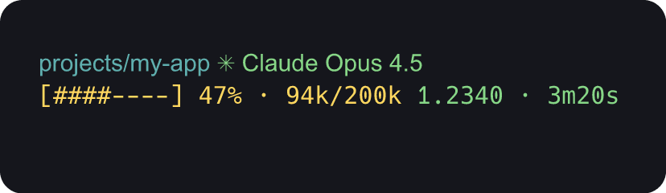

### 30. `sorin`

Plain/transparent style with Solarized-adjacent palette: steel-blue directory, yellow-ochre git, red cost accent, white default text — no backgrounds, minimal noise.

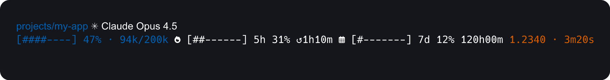

### 31. `pure`

Minimalist plain style in Nord palette: steel-blue directory, mauve model, dim-grey git, muted cyan context gauge, sage-green cost — calm two-line layout.

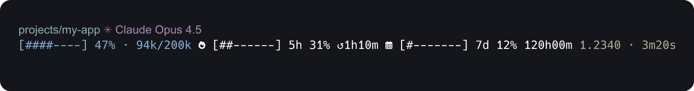

### 32. `lambda`

Ultra-minimal plain style: bold crimson red for directory and context gauge, off-white default text on transparent background — stark two-colour lambda aesthetic.

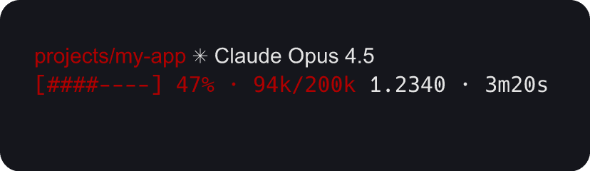

### 33. `star`

Plain style in One Dark palette: teal directory, purple model and git, sage-green cost, coral/pink accents — vibrant multi-colour transparent layout.

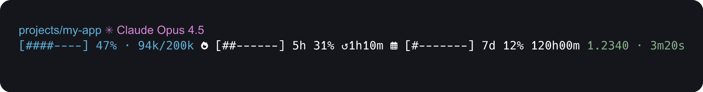

### 34. `spaceship`

Plain/transparent style with no backgrounds; cyan directory, pink git, light-yellow model, green cost — faithful to the spaceship-prompt minimalist aesthetic.

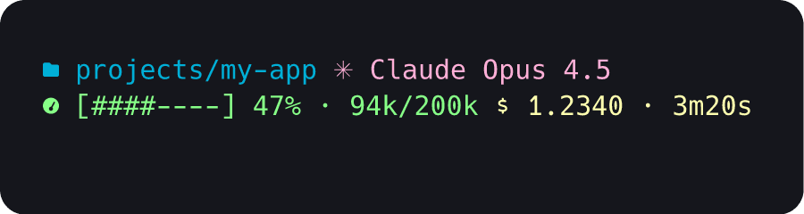

### 35. `atomic`

Diamond bubbles with rounded caps; vibrant cobalt-blue, orange, and yellow palette on dark backgrounds with a teal/cyan accent line.

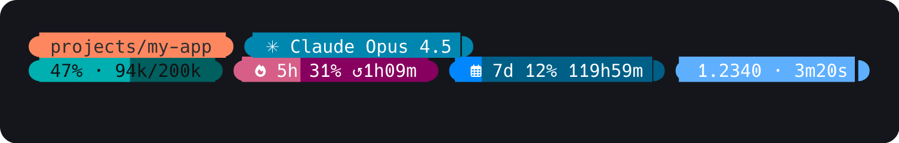

### 36. `cobalt2`

Diamond bubbles with rounded caps; Wes Bos's cobalt2 palette of deep cobalt blue, electric green, and golden yellow on near-black.

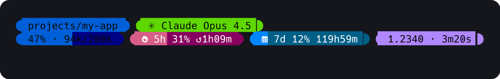

### 37. `night-owl`

Powerline style with Sarah Drasner's Night Owl palette: periwinkle directory, lime-green model, warm-yellow git, on a near-black #011627 background with teal context line.

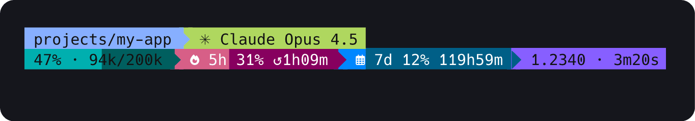

### 38. `material`

Plain/transparent style with atom-one-dark palette: cyan path, purple model, blue-grey git, vivid green cost — no backgrounds, minimal clutter.

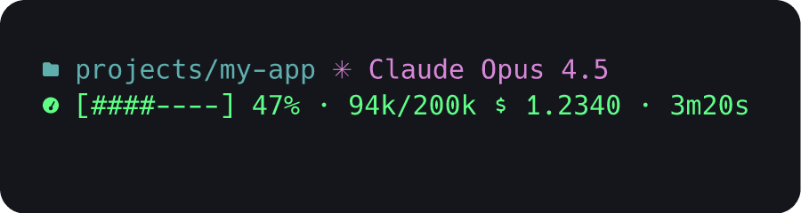

### 39. `blue-owl`

Powerline style with deep navy/cobalt blue backgrounds, vivid cyan session text, and dynamic green/yellow/purple git state indicators.

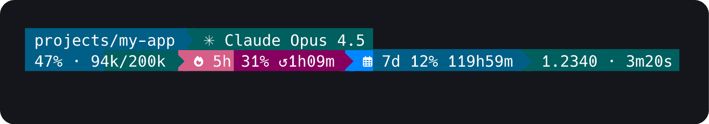

### 40. `blueish`

Powerline style with a cool steel-grey/teal palette: slate-grey default, bright teal path, light-blue git panel, cyan context bar.

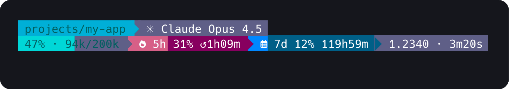

### 41. `m365princess`

Powerline style with a warm feminine palette: blush pink path, plum model, salmon git, sky-blue repo, teal cost — inspired by Microsoft 365 branding.

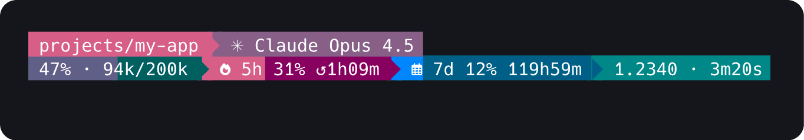

### 42. `neko`

Kawaii plain/transparent theme: warm orange gauge, teal directory, blue git, pink-red repo on a colourless background with zero separators.

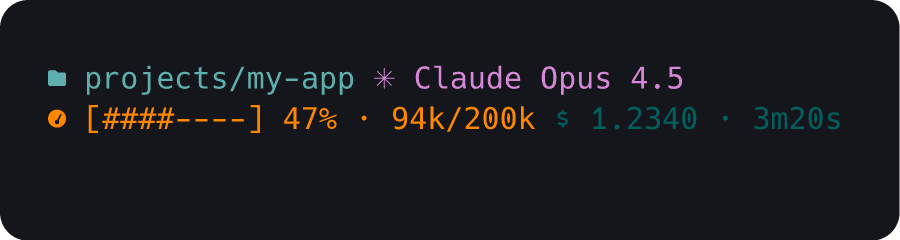

### 43. `unicorn`

Powerline theme in dark teal + electric blue + lime-green with a hot-pink unicorn flair; white text on rich coloured segment backgrounds.

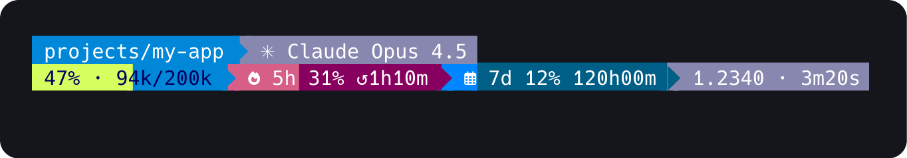

### 44. `multiverse-neon`

Floating diamond bubbles on dark indigo with neon green directory, electric cyan model, orange repo accent — a sci-fi multiverse aesthetic.

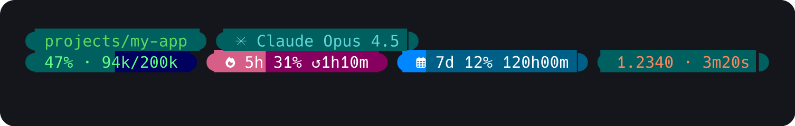

### 45. `thecyberden`

Powerline cyber-terminal in electric blue + gold + teal; sharp contrast between blue directory, gold model, teal/dynamic git, and gold cost.

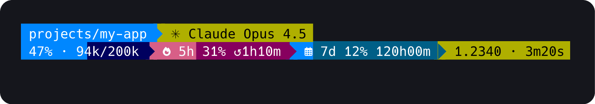

### 46. `plague`

Diamond-cap dark theme: blood-red directory on bg 196, teal context gauge, electric-green cost bar — aggressive high-contrast palette with rounded bubble caps.

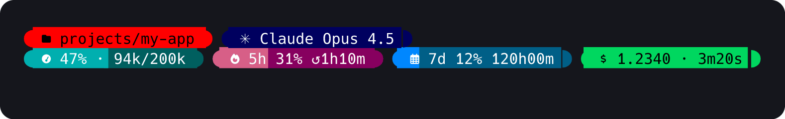

### 47. `darkblood`

Plain/transparent style with white text and burnt-orange (#CB4B16 → xterm 166) accents — no backgrounds, minimal bracket-framed aesthetic.

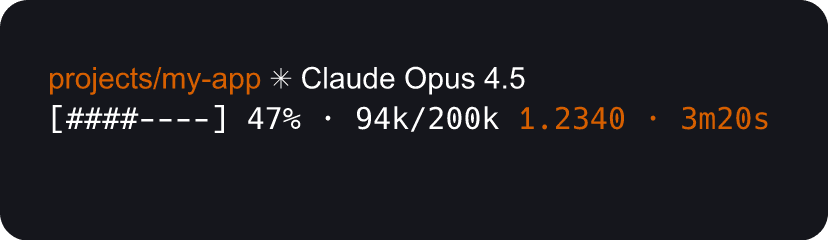

### 48. `half-life`

Plain style: electric-green (118) directory, cyan (81) git, purple (97) model, orange (166) cost — no backgrounds, lambda-prompt inspired palette.

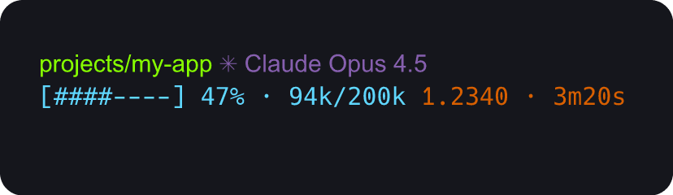

### 49. `aliens`

One Dark palette with rounded-left powerline flow: sky-blue (75) directory, purple (134) model, mint (121) git, coral-pink (204) cost segment.

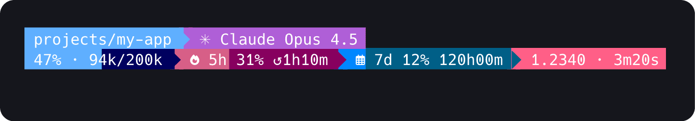

### 50. `catppuccin-latte`

Plain/transparent style on a light cream base; Catppuccin Latte palette with blue directory, mauve model, pink git, teal context — dark fg (59) for readability on the bright background.

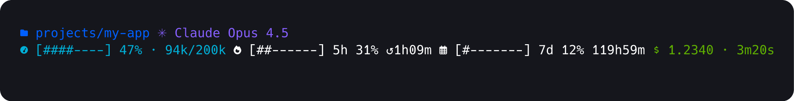

### 51. `catppuccin-macchiato`

Powerline style on a deep dark-navy base (#24273A→235); Catppuccin Macchiato palette with soft blue directory (111), mauve model (183), lavender context (147), pink cost (218) — pastel accents on dark fills.


### 52. `catppuccin-frappe`

Powerline style on a grey-indigo mid-dark base (#303446→237); Catppuccin Frappé palette with soft blue directory (111), mauve model (182), lavender context (147), pink cost (218) — slightly warmer and lighter than Macchiato.


### 53. `tokyo`

Plain/transparent style matching the OMP Tokyo theme's box-drawing outline aesthetic; steel-blue fg (110) default, white directory (231), purple model (146), pink git (218), orange cost (203) — no filled backgrounds.


### 54. `tokyonight-storm`

Plain/transparent style using Tokyo Night Storm's palette: magenta-purple directory, pistachio-green model, sky-blue repo, yellow cost — all on a dark terminal with no background fills.


### 55. `the-unnamed`

Plain/transparent style with bold neon palette: teal directory, hot-pink git, cornflower-blue model, mint repo, canary-yellow cost — high-contrast jewel tones on dark background.


### 56. `space`

Plain/transparent style with a spacey colour set: light-green directory, violet model, sky-blue git, cyan repo, amber cost — minimal transparent prompt inspired by space theme's open feel.


### 57. `takuya`

Diamond style with filled rounded-bubble segments: dark-grey directory, deep-blue model, yellow git, dark-grey repo on line 1; deep-blue context gauge with teal cost — powerline dividers between blocks.


### 58. `tonybaloney`

Dark navy background (#18354c / xterm 23) with golden amber accents (#ffc107 / xterm 214), diamond separator style with rounded left cap and powerline right arrow — bold two-tone contrast.


### 59. `honukai`

Plain transparent style with cool blue (#0377C8), forest green (#4A9207), and olive yellow (#B8B80A) — clean minimal text-only look with no backgrounds.


### 60. `di4am0nd`

Plain transparent, very minimal: gold (#FFBD00) for model, cyan (#00C6F7) for directory, red (#F62F2E) for git — vivid three-colour palette with no backgrounds or separators.


### 61. `smoothie`

Plain transparent neon palette: hot pink directory (#ffaed8), lime green model (#b1ff4f), sky blue git (#62beff), teal context (#3ce6bf), violet cost (#9966ff) — vivid pastel neon on dark terminal.


### 62. `sonicboom-dark`

Pitch-black base with electric cyan (#43CCEA) accents and bright-green git; plain/transparent style — no segment backgrounds, minimal two-colour look.


### 63. `wholespace`

Warm cream/white background (#FEF5ED) with dark navy text, cobalt-blue (#516BEB) model, teal-green (#17D7A0) git and cost; diamond style with standard round caps.


### 64. `velvet`

Deep midnight-purple gradient (#0E050F → #69307A) with soft lavender (#EFDCF9) text and lime-yellow model accent; powerline flame divider throughout.


### 65. `ys`

Terminal-native plain style: no backgrounds, colour-coded text only — light-blue directory, white model, cyan git, yellow context and cost; clean monochrome minimalism.


### 66. `agnoster-minimal-1l`

agnoster-minimal one-line (minimal): directory, context


### 67. `agnoster-1l`

agnoster one-line (compact): directory, model, git, context


### 68. `agnosterplus-1l`

agnosterplus one-line (minimal): model, context


### 69. `aliens-1l`

aliens one-line (compact): model, git, context, cost


### 70. `atomic-1l`

atomic one-line (minimal): git, context


### 71. `blue-owl-1l`

blue-owl one-line (compact): directory, git, context, limits


### 72. `blueish-1l`

blueish one-line (minimal): model, cost


### 73. `bubbles-1l`

bubbles one-line (compact): directory, model, context, cost


### 74. `catppuccin-frappe-1l`

catppuccin-frappe one-line (minimal): directory, model


### 75. `catppuccin-latte-1l`

catppuccin-latte one-line (compact): directory, model, git, context, cost


### 76. `catppuccin-macchiato-1l`

catppuccin-macchiato one-line (minimal): directory, context


### 77. `catppuccin-1l`

catppuccin one-line (compact): directory, model, git, context


### 78. `cert-1l`

cert one-line (minimal): model, context


### 79. `chips-1l`

chips one-line (compact): model, git, context, cost


### 80. `cobalt2-1l`

cobalt2 one-line (minimal): git, context


### 81. `cyberpunk-1l`

cyberpunk one-line (compact): directory, git, context, limits


### 82. `darkblood-1l`

darkblood one-line (minimal): model, cost


### 83. `di4am0nd-1l`

di4am0nd one-line (compact): directory, model, context, cost


### 84. `dracula-1l`

dracula one-line (minimal): directory, model


### 85. `emodipt-1l`

emodipt one-line (compact): directory, model, git, context, cost


### 86. `flame-1l`

flame one-line (minimal): directory, context


### 87. `gruvbox-1l`

gruvbox one-line (compact): directory, model, git, context


### 88. `half-life-1l`

half-life one-line (minimal): model, context


### 89. `honukai-1l`

honukai one-line (compact): model, git, context, cost


### 90. `jandedobbeleer-1l`

jandedobbeleer one-line (minimal): git, context


### 91. `lambda-1l`

lambda one-line (compact): directory, git, context, limits


### 92. `m365princess-1l`

m365princess one-line (minimal): model, cost


### 93. `material-1l`

material one-line (compact): directory, model, context, cost


### 94. `matrix-1l`

matrix one-line (minimal): directory, model


### 95. `minimal-1l`

minimal one-line (compact): directory, model, git, context, cost


### 96. `monokai-1l`

monokai one-line (minimal): directory, context


### 97. `multiverse-neon-1l`

multiverse-neon one-line (compact): directory, model, git, context


### 98. `neko-1l`

neko one-line (minimal): model, context


### 99. `night-owl-1l`

night-owl one-line (compact): model, git, context, cost


### 100. `nord-1l`

nord one-line (minimal): git, context


### 101. `onedark-1l`

onedark one-line (compact): directory, git, context, limits


### 102. `paradox-1l`

paradox one-line (minimal): model, cost


### 103. `plague-1l`

plague one-line (compact): directory, model, context, cost


### 104. `powerlevel10k-lean-1l`

powerlevel10k-lean one-line (minimal): directory, model


### 105. `powerlevel10k-modern-1l`

powerlevel10k-modern one-line (compact): directory, model, git, context, cost


### 106. `powerlevel10k-rainbow-1l`

powerlevel10k-rainbow one-line (minimal): directory, context


### 107. `powerline-1l`

powerline one-line (compact): directory, model, git, context


### 108. `pure-1l`

pure one-line (minimal): model, context


### 109. `robbyrussell-1l`

robbyrussell one-line (compact): model, git, context, cost


### 110. `rose-pine-1l`

rose-pine one-line (minimal): git, context


### 111. `slant-1l`

slant one-line (compact): directory, git, context, limits


### 112. `smoothie-1l`

smoothie one-line (minimal): model, cost


### 113. `solarized-dark-1l`

solarized-dark one-line (compact): directory, model, context, cost


### 114. `solarized-light-1l`

solarized-light one-line (minimal): directory, model


### 115. `sonicboom-dark-1l`

sonicboom-dark one-line (compact): directory, model, git, context, cost


### 116. `sorin-1l`

sorin one-line (minimal): directory, context


### 117. `space-1l`

space one-line (compact): directory, model, git, context


### 118. `spaceship-1l`

spaceship one-line (minimal): model, context


### 119. `star-1l`

star one-line (compact): model, git, context, cost


### 120. `takuya-1l`

takuya one-line (minimal): git, context


### 121. `the-unnamed-1l`

the-unnamed one-line (compact): directory, git, context, limits


### 122. `thecyberden-1l`

thecyberden one-line (minimal): model, cost


### 123. `tokyo-1l`

tokyo one-line (compact): directory, model, context, cost


### 124. `tokyonight-storm-1l`

tokyonight-storm one-line (minimal): directory, model


### 125. `tokyonight-1l`

tokyonight one-line (compact): directory, model, git, context, cost


### 126. `tonybaloney-1l`

tonybaloney one-line (minimal): directory, context


### 127. `unicorn-1l`

unicorn one-line (compact): directory, model, git, context


### 128. `velvet-1l`

velvet one-line (minimal): model, context


### 129. `wholespace-1l`

wholespace one-line (compact): model, git, context, cost


### 130. `ys-1l`

ys one-line (minimal): git, context


### 131. `spaced`

Spaced pills (diamond): model · context · 5h · 7d, one line


### 132. `spaced-warm`

Spaced pills (diamond) in a warm ember palette: model · context · 5h · 7d


### 133. `spaced-cool`

Spaced pills (diamond) in a cool teal/blue palette: model · context · 5h · 7d


### 134. `spaced-mono`

Spaced pills (diamond) in muted monochrome grey: model · context · 5h · 7d


### 135. `spaced-dracula`

Spaced pills (bubble): model · context(tokens) · 5h · 7d


### 136. `spaced-gruvbox`

Spaced pills (slant): model · context(tokens) · 5h · 7d


### 137. `spaced-nord`

Spaced pills (flame): model · context(tokens) · 5h · 7d


### 138. `spaced-tokyo`

Spaced pills (pl): model · context(tokens) · 5h · 7d


### 139. `spaced-catppuccin`

Spaced pills (plslant): model · context(tokens) · 5h · 7d


### 140. `spaced-monokai`

Spaced pills (plflame): model · context(tokens) · 5h · 7d


### 141. `spaced-onedark`

Spaced pills (round): model · context(tokens) · 5h · 7d


### 142. `spaced-rosepine`

Spaced pills (plain): model · context(tokens) · 5h · 7d


### 143. `spaced-cobalt`

Spaced pills (bubble): model · context(tokens) · 5h · 7d


### 144. `spaced-nightowl`

Spaced pills (slant): model · context(tokens) · 5h · 7d


### 145. `spaced-blueowl`

Spaced pills (flame): model · context(tokens) · 5h · 7d


### 146. `spaced-atomic`

Spaced pills (pl): model · context(tokens) · 5h · 7d


### 147. `spaced-m365`

Spaced pills (plslant): model · context(tokens) · 5h · 7d


### 148. `spaced-unicorn`

Spaced pills (plflame): model · context(tokens) · 5h · 7d


### 149. `spaced-material`

Spaced pills (round): model · context(tokens) · 5h · 7d


### 150. `spaced-solarized`

Spaced pills (plain): model · context(tokens) · 5h · 7d


### 151. `spaced-forest`

Spaced pills (bubble): model · context(tokens) · 5h · 7d


### 152. `spaced-neon`

Spaced pills (slant): model · context(tokens) · 5h · 7d


### 153. `spaced-ember`

Spaced pills (flame): model · context(tokens) · 5h · 7d


### 154. `spaced-latte`

Spaced pills (pl): model · context(tokens) · 5h · 7d


### 155. `loaded`

Loaded one-line (bubble): model · git · context(tokens) · 5h · 7d · cost


### 156. `loaded-warm`

Loaded one-line (slant): model · git · context(tokens) · 5h · 7d · cost


### 157. `loaded-cool`

Loaded one-line (flame): model · git · context(tokens) · 5h · 7d · cost


### 158. `loaded-mono`

Loaded one-line (pl): model · git · context(tokens) · 5h · 7d · cost


### 159. `loaded-dracula`

Loaded one-line (plslant): model · git · context(tokens) · 5h · 7d · cost


### 160. `loaded-gruvbox`

Loaded one-line (plflame): model · git · context(tokens) · 5h · 7d · cost


### 161. `loaded-nord`

Loaded one-line (round): model · git · context(tokens) · 5h · 7d · cost


### 162. `loaded-tokyo`

Loaded one-line (plain): model · git · context(tokens) · 5h · 7d · cost


### 163. `loaded-catppuccin`

Loaded one-line (bubble): model · git · context(tokens) · 5h · 7d · cost


### 164. `loaded-monokai`

Loaded one-line (slant): model · git · context(tokens) · 5h · 7d · cost


### 165. `loaded-onedark`

Loaded one-line (flame): model · git · context(tokens) · 5h · 7d · cost


### 166. `loaded-rosepine`

Loaded one-line (pl): model · git · context(tokens) · 5h · 7d · cost


### 167. `loaded-cobalt`

Loaded one-line (plslant): model · git · context(tokens) · 5h · 7d · cost


### 168. `loaded-nightowl`

Loaded one-line (plflame): model · git · context(tokens) · 5h · 7d · cost


### 169. `loaded-blueowl`

Loaded one-line (round): model · git · context(tokens) · 5h · 7d · cost


### 170. `loaded-atomic`

Loaded one-line (plain): model · git · context(tokens) · 5h · 7d · cost


### 171. `loaded-m365`

Loaded one-line (bubble): model · git · context(tokens) · 5h · 7d · cost


### 172. `loaded-unicorn`

Loaded one-line (slant): model · git · context(tokens) · 5h · 7d · cost


### 173. `loaded-material`

Loaded one-line (flame): model · git · context(tokens) · 5h · 7d · cost


### 174. `loaded-solarized`

Loaded one-line (pl): model · git · context(tokens) · 5h · 7d · cost


### 175. `loaded-forest`

Loaded one-line (plslant): model · git · context(tokens) · 5h · 7d · cost


### 176. `loaded-neon`

Loaded one-line (plflame): model · git · context(tokens) · 5h · 7d · cost


### 177. `loaded-ember`

Loaded one-line (round): model · git · context(tokens) · 5h · 7d · cost


### 178. `loaded-latte`

Loaded one-line (bubble): model · git · context(tokens) · 5h · 7d · cost


